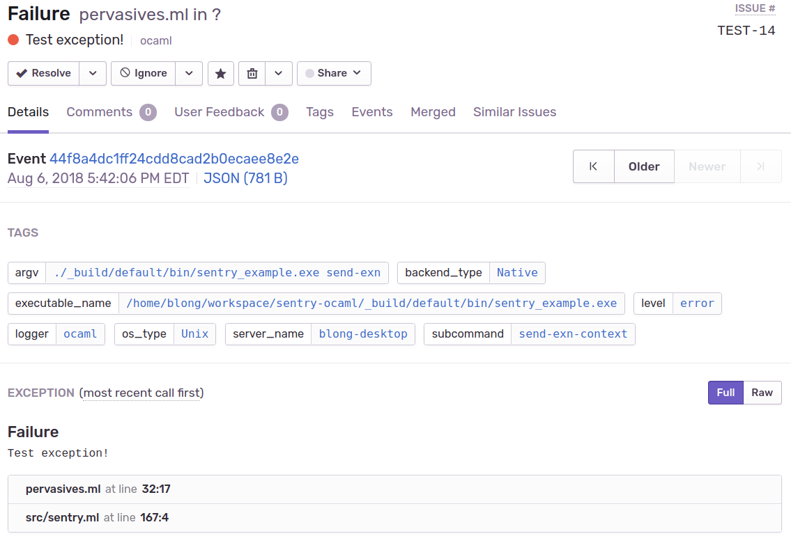

[](https://circleci.com/gh/brendanlong/sentry-ocaml)
[](https://coveralls.io/github/brendanlong/sentry-ocaml?branch=master)
[](https://github.com/brendanlong/sentry-ocaml/releases/latest)
[](http://unlicense.org/)
[](https://brendanlong.github.io/sentry-ocaml/sentry/index.html)

# Sentry (OCaml) - WORK IN PROGRESS

This is an unofficial work-in-progress [Sentry](https://sentry.io) library for
OCaml.

**This currently requires the Async scheduler to be running or data will not
be uploaded**

## Missing features:

  - Only supports Async (pull requests to factor out Lwt/Unix are welcome!)
  - Global unhandled exception handler isn't implemented yet.
  - Probably other things

## Example

See [the example program](bin/sentry_example.ml).

In general, you should use this like:

```
let () =
  let spec = Command.Spec.(...) in
  Command.async_spec ~summary:"..." spec @@ fun args () ->
  (* Using [SENTRY_DSN] from the environment *)
  Sentry.with_exn_handler @@ fun () ->
  (* your normal code here *)
```

**To release the warning above: The Async schedule *must* be running.**

This will execute your code as usual, and if it throws an exception, it will be
uploaded to Sentry:



Then the exception will be re-thrown so your program will exit and print the
backtrace to stderr as usual (if you want to continue after errors, wrap
`Sentry.with_exn_handler` in another error handler or use `Sentry.with_exn_handler_ignore`).

Note that `Sentry.with_error_and_exn_handler` exists (which handles both exceptions and
`Or_error.t`), but using exceptions exclusively is recommended because they have
backtraces (and wrapping exceptions in `Error.t` loses whatever backtrace did
exist in most cases).

## Tags

We upload some data by default. From environment variables, we get:

  - `SENTRY_ENVIRONMENT` -> `environment`
  - `SENTRY_RELEASE` -> `release`

From `Sys` or `Unix`:

  - `Sys.argv` -> `argv`
  - `Sys.backend_type` -> `backend_type`
  - `Sys.executable_name` -> `executable_name`
  - `Sys.gethostname` -> `server_name`
  - `Sys.os_type` -> `os_type`

You can override any of these with `Sentry.merge_extra`,
`Sentry.set_environment`, and `Sentry.set_release`.

You can also upload custom tags using either `Sentry.merge_tags` or by passing
`~tags` to a `capture` function. Tags will be merged for the
current async job, so you only need to pass additional tags:

```
Sentry.merge_tags [ "app_name", "http_server" ];
Sentry.with_exn_handler @@ fun () ->
...
Sentry.merge_tags [ "method", "GET", "path", "/example" ];
...
(* This will upload with default tags + app_name, method, path, and user_id *)
Sentry.capture_message ~tags:[ "user_id", user_id ] "invalid login"
```
